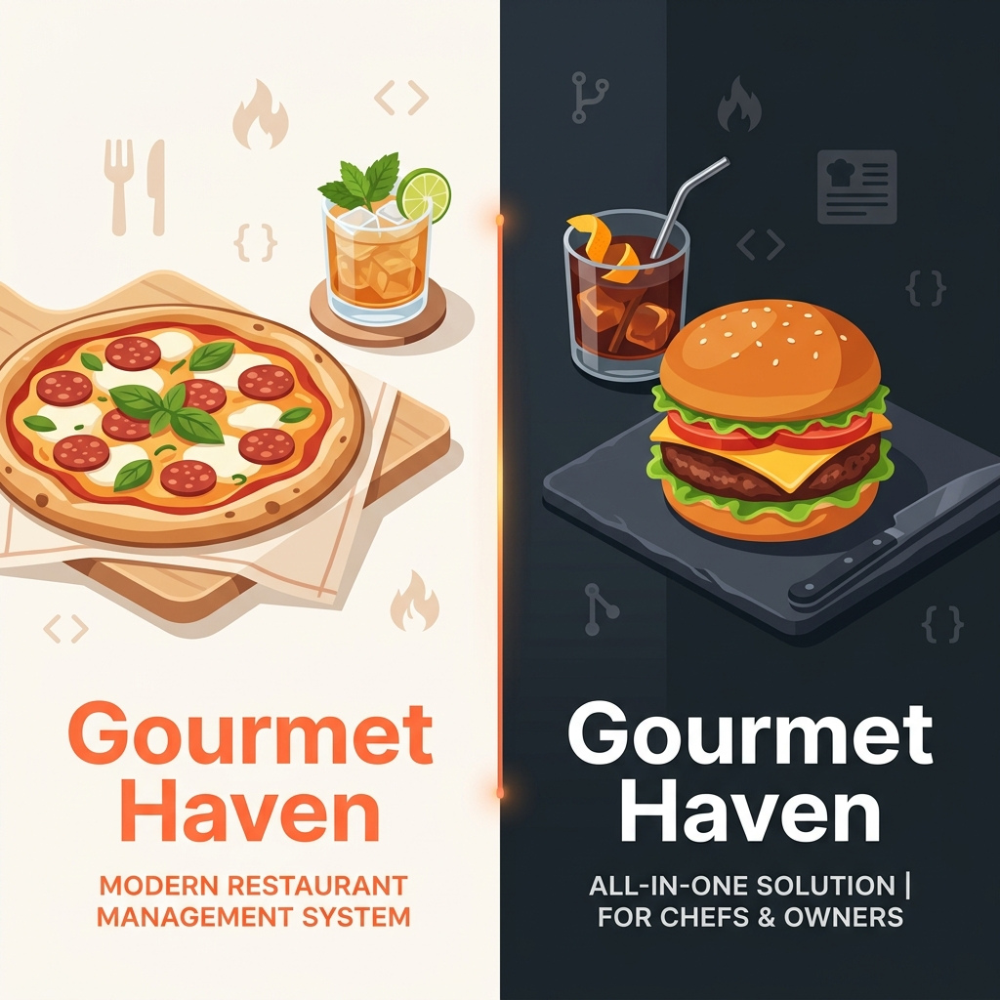
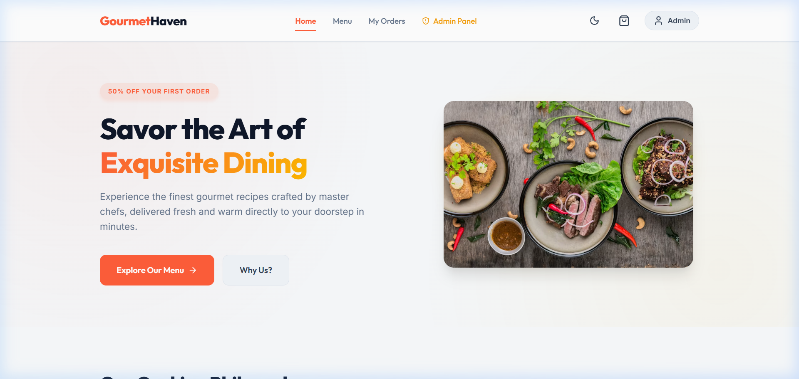
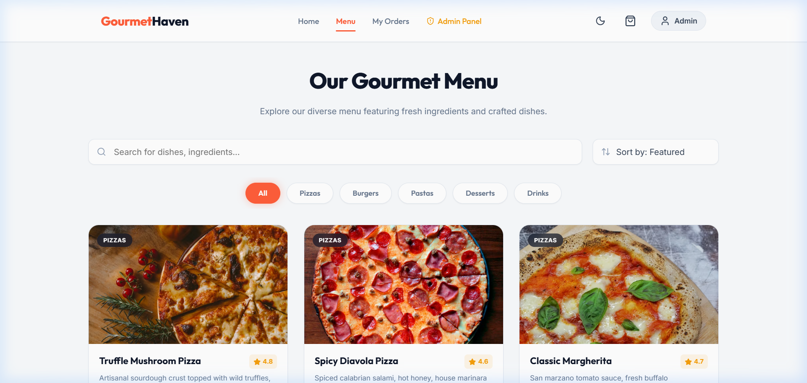
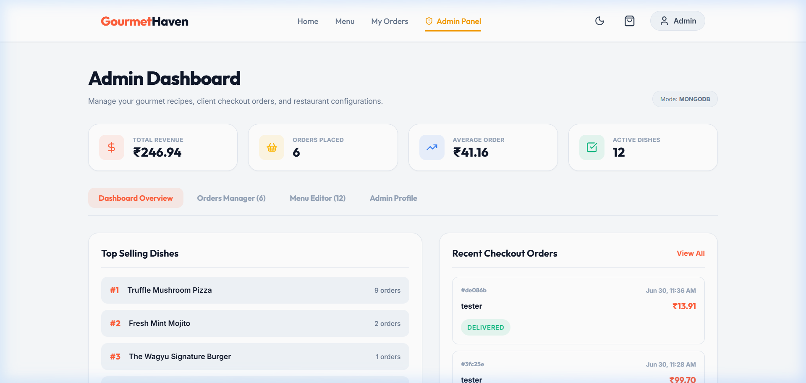

# 🍽️ Gourmet Haven - Restaurant Management System (RMS)

Gourmet Haven is a modern, premium full-stack food ordering and restaurant management platform. Designed for both customer ordering and comprehensive administrative back-office management, the application offers a premium user interface with a seamless light/dark mode theme selector, interactive cart/checkout flows, order progress tracking, and robust sales analytics.

---

## 📸 Application Screenshots

### 🏠 Customer Storefront Landing Page


### 🍕 Interactive Food Menu Catalog


### 📊 Back-Office Administration Dashboard


---

## 🚀 Key Features

### 🛒 Customer Storefront
*   **Menu Catalog:** Interactive menu catalog categorized by Pizzas, Burgers, Pastas, Desserts, and Drinks.
*   **Dynamic Cart & Checkout:** Real-time subtotal, delivery fee, and tax calculations with editable delivery addresses.
*   **Order Tracking:** Live order details screen displaying order status (`Pending` ➔ `Preparing` ➔ `Out for Delivery` ➔ `Delivered`).
*   **Profile & Security:** User authentication powered by JWT, with profile editing and secure passwords.

### 📊 Administrative Control Center
*   **Analytics Dashboard:** Metrics tracking total revenue, order volumes, average order value, and pending queues.
*   **Live Order Queue:** Status toggles, client details cards, and print-ready dispatch slip generation.
*   **Interactive Menu Editor:** Real-time dish creator, metadata editor (pricing, categories, descriptions), and one-click availability controls.

### 🛡️ Technical Highlights
*   **Dual-Database Fallback:** Runs in MongoDB mode by default. If MongoDB is unavailable, the server automatically switches to local file-system JSON stores (`users.json`, `fooditems.json`, `orders.json`) for zero-configuration local development.
*   **Adaptive Theme System:** Built-in light/dark theme switch that changes variables and styles across the entire application instantly.
*   **Completely Responsive:** Sleek desktop navbar, mobile toggle hamburger navigation, grid catalog layouts, and touch-friendly overlays.

---

## 🛠️ Technology Stack

| Component | Technology |
| :--- | :--- |
| **Frontend** | React, React Router Dom, Lucide Icons, Vanilla CSS |
| **Backend** | Node.js, Express, JWT Authentication, Bcrypt |
| **Database** | MongoDB / Mongoose (with automated local JSON file fallback) |
| **Build Tool** | Vite, PostCSS |

---

## 🔑 Test Credentials

Use these default credentials to test the application immediately after running the seed script:

*   **Administrator Account:**
    *   **Email:** `admin@haven.com`
    *   **Password:** `admin123`
*   **Customer Account:**
    *   **Email:** `customer@haven.com`
    *   **Password:** `cust123` *(Or click "Sign Up" on the login screen to register your own!)*

---

## ⚙️ Installation & Running Locally

### 1. Prerequisites
Ensure you have [Node.js](https://nodejs.org/) installed. MongoDB is recommended but optional (the app will fall back to local JSON data files if MongoDB is not running).

### 2. Clone the Repository
```bash
git clone https://github.com/rajvarma2001/gourmet-haven-rms.git
cd gourmet-haven-rms/"Restaurant Management System"
```

### 3. Setup Backend
1. Navigate to the backend directory and install dependencies:
   ```bash
   cd backend
   npm install
   ```
2. Set up your environment variables by creating a `.env` file in the `backend` folder:
   ```env
   PORT=5000
   MONGO_URI=mongodb://127.0.0.1:27017/restaurant-ms
   JWT_SECRET=supersecretkey_gourmet_haven
   NODE_ENV=development
   ```
3. Run the database seed script to populate sample items and credentials:
   ```bash
   npm run seed
   ```
4. Start the backend development server:
   ```bash
   npm run dev
   ```

### 4. Setup Frontend
1. Open a new terminal window, navigate to the frontend directory, and install dependencies:
   ```bash
   cd ../frontend
   npm install
   ```
2. Start the Vite development server:
   ```bash
   npm run dev
   ```
3. Open your browser and navigate to **[http://localhost:5173/](http://localhost:5173/)**.

---

## 📁 Project Directory Structure
```text
Restaurant Management System/
├── backend/
│   ├── config/          # Database & Mock DB configuration
│   ├── controllers/     # Route logic controllers (Auth, Food, Orders)
│   ├── data/            # Local JSON database files (automatically generated)
│   ├── middleware/      # JWT protected routes & admin checks
│   ├── models/          # Mongoose database schemas
│   ├── routes/          # Express API route declarations
│   ├── scripts/         # DB seed scripts
│   ├── server.js        # Main server entrypoint
│   └── package.json
├── frontend/
│   ├── public/          # Assets and favicon files
│   ├── src/
│   │   ├── assets/      # Image files and vectors
│   │   ├── components/  # Shared layouts (Navbar, FoodCard, CartItems)
│   │   ├── context/     # Global state handlers (CartContext, AuthContext)
│   │   ├── pages/       # Layout pages (Home, Menu, Admin, Checkout)
│   │   ├── App.jsx      # Route switches & base layout
│   │   ├── index.css    # Core design variables & typography tokens
│   │   └── main.jsx     # Bootstrap root renderer
│   ├── index.html
│   └── package.json
└── .gitignore           # Global git ignore configurations
```
